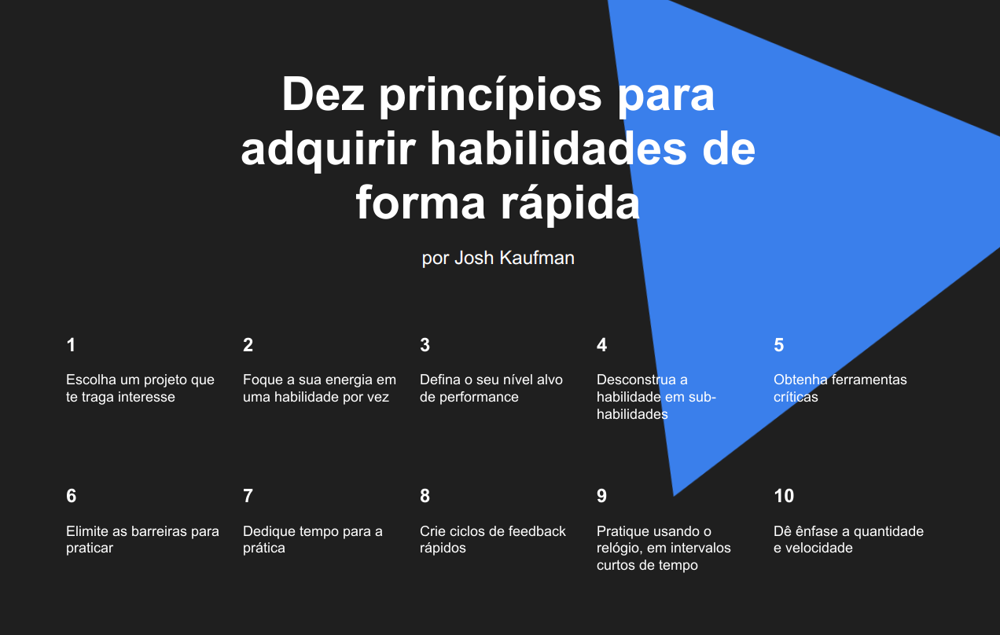

# Aprendendo a Aprender

A página Aprendendo a Aprender foi desenvolvido em HTML e CSS, com o uso de animações para tornar a experiência mais dinâmica. Ela é dividida em seções que apresentam diversas técnicas e metodologias de aprendizado eficazes e conta com um iframe para incorporar vídeos do YouTube.

**Para ver o projeto em execução <a href="https://vinimello90.github.io/web_extra_project_tripleten/">clique aqui</a>.**

## Recursos do projeto

- HTML5 semântico
- Metologia BEM
- Flexbox
- iframe
- CSS Animations

## Descrição das Tecnologias e Técnicas Utilizadas

### HTML semântico

O `HTML semântico` foi aplicado para tornar o código mais compreensível.

### Metodologia BEM

A `metodologia BEM` facilita a manutenção e a compreensão do código.

### iframe

A tag `iframe` foi utilizada para incorporar e tornar possível assistir ao vídeo adicionado diretamente na própria página sem ser redirecinado.

### CSS Animations

Foi utilizado a propriedade no css `animation` juntamente com a regra CSS `@keyframes` para criar animações, rotacionando as formas ao fundo da página.

