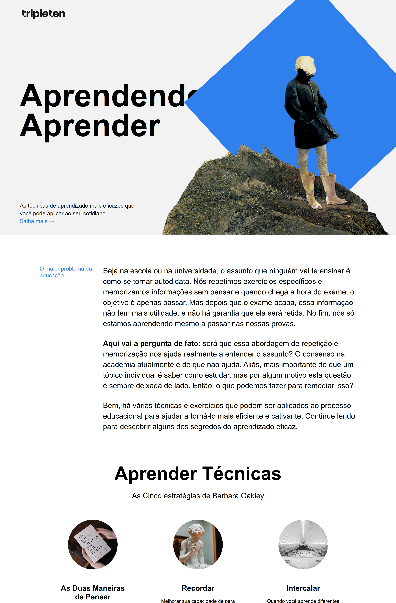
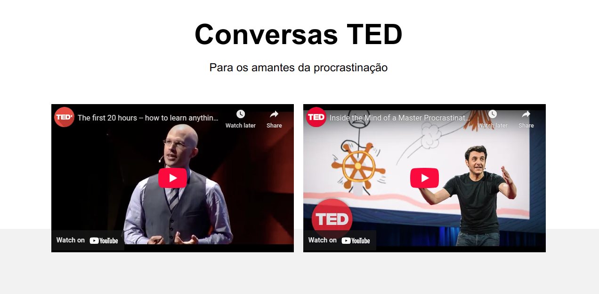
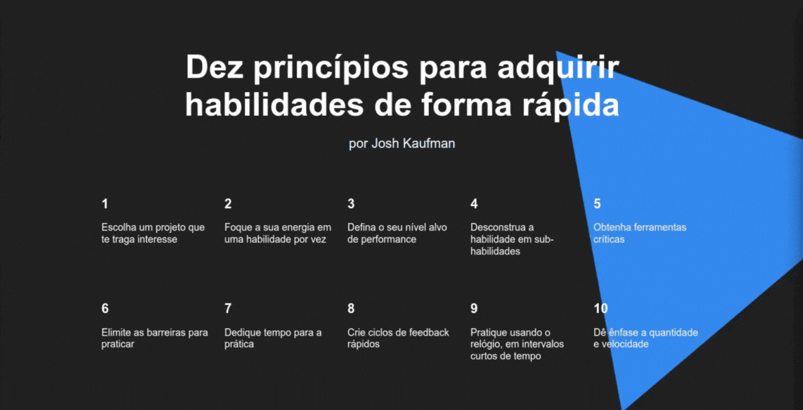

# Aprendendo a Aprender

A página **Aprendendo a Aprender** foi desenvolvida em HTML e CSS, com o uso de animações para tornar a experiência mais dinâmica. Ela é dividida em seções que apresentam diversas técnicas e metodologias de aprendizado eficazes e conta com um `iframe` para incorporar vídeos do YouTube.

**Veja o projeto em execução clicando [aqui](https://vinimello90.github.io/web_extra_project_tripleten/).**

## Recursos do Projeto

- HTML5 semântico
- Metodologia BEM
- Flexbox
- iframe
- CSS Animations

## Descrição das Tecnologias e Técnicas Utilizadas

### HTML Semântico

O uso de **HTML semântico** torna o código mais legível e acessível, facilitando a manutenção e melhorando a compreensão do conteúdo.

### Metodologia BEM

A **metodologia BEM (Bloco, Elemento, Modificador)** foi aplicada para organizar as classes CSS, o que facilita a escalabilidade e a manutenção do código.

### Flexbox

A utilização de **Flexbox** garante melhor distribuição do layout e organiza os elementos de forma mais responsiva.

### iframe

A tag **iframe** foi utilizada para incorporar vídeos diretamente na página, permitindo que os usuários assistam ao conteúdo sem precisar ser redirecionados para outra página.

### CSS Animations

Utilizei a propriedade **animation** juntamente com a regra CSS **@keyframes** para criar animações que rotacionam as formas ao fundo da página, adicionando dinamismo ao layout.

